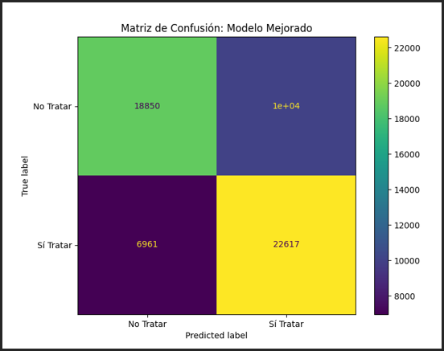
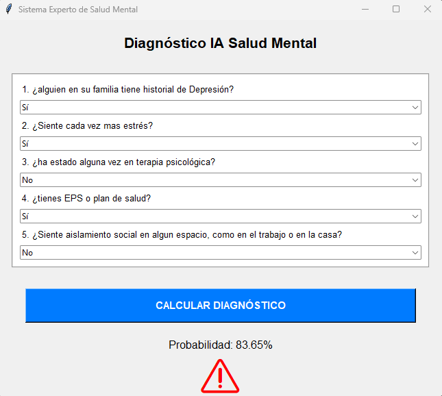

# Predicción de Necesidad de Tratamiento en Salud Mental 🧠
### Uso de Regresión Logística e Inteligencia Artificial

**Institución:** Politécnico Colombiano Jaime Isaza Cadavid  
**Autor:** Juan Muñoz  
**Contacto:** juan_munoz91202@elpoli.edu.co  

---

## 📋 Resumen
En este proyecto se aplicó la técnica de inteligencia artificial de **Regresión Logística** para resolver un problema de clasificación binaria en el ámbito de la salud. El objetivo fue predecir si una persona necesita tratamiento psicológico basándose en variables personales y laborales. 

Se utilizó un dataset de encuestas de salud mental ("Mental Health Dataset") procesando variables clave como el historial familiar y el conocimiento de opciones de cuidado. El sistema alcanzó una **exactitud del 71%** y una **sensibilidad (Recall) del 76%**, demostrando que es capaz de detectar eficazmente a la mayoría de los pacientes en riesgo. 

**Conclusión clave:** Se determinó que factores estructurales, como saber si se cuenta con cobertura médica, son predictores más fuertes que el estrés laboral momentáneo.

---

## 📖 1. Introducción
La salud mental se ha convertido en uno de los desafíos más críticos de la sociedad moderna, especialmente en entornos laborales de alta presión. Según la Organización Mundial de la Salud (OMS), trastornos como la depresión y la ansiedad cuestan a la economía mundial billones de dólares en pérdida de productividad cada año. Sin embargo, el estigma y la falta de autoconocimiento provocan que muchas personas no busquen la ayuda profesional que necesitan a tiempo.

Ante este panorama, la Inteligencia Artificial y el Machine Learning emergen como herramientas poderosas para el cribado y la detección temprana. Este proyecto busca utilizar estas tecnologías para crear un modelo predictivo que ayude a identificar la probabilidad de que una persona requiera intervención profesional.

**Sobre los Datos:**
Se utilizó el dataset público *"Mental Health Dataset"*. Los datos fueron transformados de valores categóricos (texto) a numéricos (0 y 1) para ser procesados matemáticamente.

---

## ⚙️ 2. Metodología: Regresión Logística

Para la construcción del modelo predictivo se seleccionaron las siguientes características tras un análisis de correlación:

### Entradas (Variables Independientes):
1.	**Historial Familiar:** Antecedentes genéticos de depresión.
2.	**Estrés Creciente:** Percepción subjetiva de estrés actual.
3.	**Historial Personal:** Diagnósticos previos del individuo.
4.	**Opciones de Cuidado:** Conocimiento sobre si el seguro médico cubre terapia (Factor determinante).
5.	**Debilidad Social:** Sentimientos de aislamiento.

### Salida (Variable Dependiente):
*   `1`: **Sí** necesita tratamiento.
*   `0`: **No** necesita tratamiento.

---

## 📊 3. Resultados y Evaluación

### Matriz de Confusión
Se observa una mayor concentración de aciertos en la detección de Verdaderos Positivos (casos que sí requerían ayuda), lo cual es ideal para un sistema de salud.


*Figura 1. Matriz de confusión del modelo.*

### Métricas Obtenidas
*	**Error:** 0.29 (29%)
*	**Exactitud (Accuracy):** 71%
*	**Precisión:** 69%
*	**Exhaustividad (Recall):** 76%
*	**F1-Score:** 0.73

> **Nota:** El alto valor de Recall (76%) indica que el modelo es altamente sensible, priorizando no dejar pasar casos de riesgo inadvertidos.

---

## 💻 4. Tecnologías y Aplicación

Para el desarrollo de este sistema se utilizó el siguiente stack tecnológico:
*   **Lenguaje:** Python 3.x
*   **Procesamiento de Datos:** Pandas, Numpy
*   **Machine Learning:** Scikit-Learn (LogisticRegression)
*   **Visualización:** Matplotlib
*   **Interfaz Gráfica:** Tkinter

### Interfaz de Usuario (GUI)
Se desarrolló una aplicación de escritorio que permite al usuario ingresar sus datos mediante formularios y obtener un diagnóstico en tiempo real.


*Figura 2. Ejecución del Sistema Experto de Diagnóstico.*

---

## 🚀 Cómo ejecutar este proyecto

1. **Clonar el repositorio:**
   ```bash
   git clone https://github.com/juanmunoz1986/paractica_IA_regrecion.git