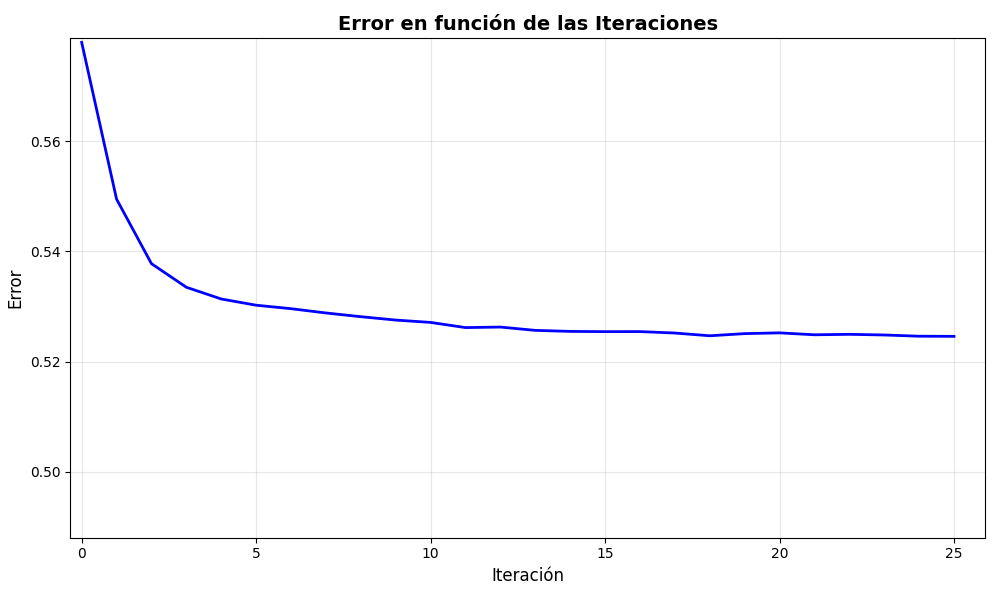
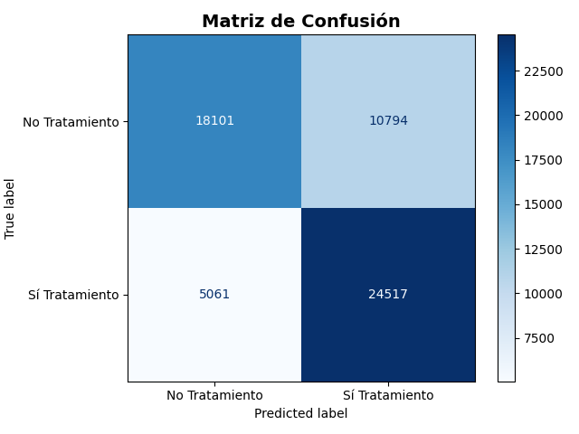

# Predicción de Necesidad de Tratamiento en Salud Mental 🧠
### Uso de Regresión Logística y Redes Neuronales con Inteligencia Artificial

**Institución:** Politécnico Colombiano Jaime Isaza Cadavid  
**Autor:** Juan Muñoz  
**Contacto:** juan_munoz91202@elpoli.edu.co

---

## 📋 Resumen
Este proyecto implementa dos técnicas de inteligencia artificial para resolver un problema de clasificación binaria en el ámbito de la salud mental: **Regresión Logística** y **Redes Neuronales Profundas**. El objetivo es predecir si una persona necesita tratamiento psicológico basándose en variables personales, laborales y de historial médico.

Se utilizó un dataset de encuestas de salud mental ("Mental Health Dataset") procesando variables clave como el historial familiar, el conocimiento de opciones de cuidado, y diversos factores psicológicos y sociales. 

**Modelo de Regresión Logística:** Alcanzó una **exactitud del 71%** y una **sensibilidad (Recall) del 76%**, demostrando que es capaz de detectar eficazmente a la mayoría de los pacientes en riesgo.

**Modelo de Red Neuronal:** Implementa una arquitectura profunda con capas densas y dropout para mejorar la generalización, procesando un conjunto más amplio de características.

**Conclusión clave:** Se determinó que factores estructurales, como saber si se cuenta con cobertura médica, son predictores más fuertes que el estrés laboral momentáneo.

---

## 📖 1. Introducción
La salud mental se ha convertido en uno de los desafíos más críticos de la sociedad moderna, especialmente en entornos laborales de alta presión. Según la Organización Mundial de la Salud (OMS), trastornos como la depresión y la ansiedad cuestan a la economía mundial billones de dólares en pérdida de productividad cada año. Sin embargo, el estigma y la falta de autoconocimiento provocan que muchas personas no busquen la ayuda profesional que necesitan a tiempo.

Ante este panorama, la Inteligencia Artificial y el Machine Learning emergen como herramientas poderosas para el cribado y la detección temprana. Este proyecto busca utilizar estas tecnologías para crear modelos predictivos que ayuden a identificar la probabilidad de que una persona requiera intervención profesional.

**Sobre los Datos:**
Se utilizó el dataset público *"Mental Health Dataset"*. Los datos fueron transformados de valores categóricos (texto) a numéricos mediante técnicas de codificación (one-hot encoding, mapeo binario) para ser procesados matemáticamente.

---

## ⚙️ 2. Metodologías Implementadas

### 2.1 Regresión Logística

Para la construcción del modelo de regresión logística se seleccionaron las siguientes características tras un análisis de correlación:

#### Entradas (Variables Independientes):
1. **Historial Familiar:** Antecedentes genéticos de depresión.
2. **Estrés Creciente:** Percepción subjetiva de estrés actual.
3. **Historial Personal:** Diagnósticos previos del individuo.
4. **Opciones de Cuidado:** Conocimiento sobre si el seguro médico cubre terapia (Factor determinante).
5. **Debilidad Social:** Sentimientos de aislamiento.

#### Salida (Variable Dependiente):
*   `1`: **Sí** necesita tratamiento.
*   `0`: **No** necesita tratamiento.

### 2.2 Red Neuronal Profunda

El modelo de red neuronal procesa un conjunto más amplio de características, incluyendo:

#### Características Adicionales:
- País de residencia
- Género
- Ocupación
- Estado laboral (trabajo por cuenta propia)
- Días sin salir de casa
- Cambios de humor recientes
- Cambios en hábitos (sueño/comida)
- Dificultades para manejar problemas
- Interés laboral
- Entrevistas previas de salud mental

#### Arquitectura:
- **Capa de entrada:** Densa con 64 neuronas y activación ReLU
- **Dropout:** 20% para prevenir sobreajuste
- **Capa oculta:** Densa con 32 neuronas y activación ReLU
- **Dropout:** 20% adicional
- **Capa de salida:** 1 neurona con activación sigmoide
- **Optimizador:** Adam
- **Función de pérdida:** Binary Crossentropy
- **Early Stopping:** Implementado para optimizar el entrenamiento

---

## 📊 3. Resultados y Evaluación

### Modelo de Regresión Logística

#### Matriz de Confusión
Se observa una mayor concentración de aciertos en la detección de Verdaderos Positivos (casos que sí requerían ayuda), lo cual es ideal para un sistema de salud.


*Figura 1. Matriz de confusión del modelo de regresión logística.*

#### Métricas Obtenidas
*	**Error:** 0.29 (29%)
*	**Exactitud (Accuracy):** 71%
*	**Precisión:** 69%
*	**Exhaustividad (Recall):** 76%
*	**F1-Score:** 0.73

> **Nota:** El alto valor de Recall (76%) indica que el modelo es altamente sensible, priorizando no dejar pasar casos de riesgo inadvertidos.

### Modelo de Red Neuronal

El modelo de red neuronal utiliza técnicas avanzadas de regularización (dropout) y early stopping para mejorar la generalización y evitar el sobreajuste. Procesa un conjunto más amplio de características, lo que permite capturar relaciones más complejas entre las variables.

#### Evolución del Error durante el Entrenamiento
La siguiente gráfica muestra cómo el error disminuye durante el proceso de entrenamiento, indicando que el modelo está aprendiendo y mejorando su capacidad de predicción.


*Figura 3. Evolución del error durante el entrenamiento de la red neuronal.*

#### Matriz de Confusión del Modelo de Red Neuronal
La matriz de confusión del modelo de red neuronal permite evaluar la capacidad del modelo para clasificar correctamente los casos.


*Figura 4. Matriz de confusión del modelo de red neuronal profunda.*

---

## 💻 4. Tecnologías y Aplicación

Para el desarrollo de este sistema se utilizó el siguiente stack tecnológico:

*   **Lenguaje:** Python 3.x
*   **Procesamiento de Datos:** Pandas, Numpy
*   **Machine Learning:** 
    - Scikit-Learn (LogisticRegression)
    - TensorFlow/Keras (Redes Neuronales)
*   **Preprocesamiento:** StandardScaler, One-Hot Encoding
*   **Persistencia:** Joblib (para guardar modelos y scalers)
*   **Visualización:** Matplotlib
*   **Interfaz Gráfica:** Tkinter

### Interfaz de Usuario (GUI)
Se desarrollaron aplicaciones de escritorio que permiten al usuario ingresar sus datos mediante formularios y obtener un diagnóstico en tiempo real. Cada modelo tiene su propia interfaz interactiva optimizada.


*Figura 2. Ejecución del Sistema Experto de Diagnóstico.*

---

## 🚀 5. Cómo ejecutar este proyecto

### Requisitos Previos

1. **Clonar el repositorio:**
   ```bash
   git clone https://github.com/juanmunoz1986/paractica_IA_regrecion.git
   cd paractica_IA_regrecion
   ```

2. **Crear un entorno virtual (recomendado):**
   ```bash
   python -m venv venv
   ```

3. **Activar el entorno virtual:**
   - En Windows:
     ```bash
     venv\Scripts\activate
     ```
   - En Linux/Mac:
     ```bash
     source venv/bin/activate
     ```

4. **Instalar dependencias:**
   ```bash
   pip install -r requirements.txt
   ```

### Estructura de Archivos

El proyecto contiene dos tipos de archivos:

#### Archivos de Entrenamiento (Backend)
- **`reg.py`**: Entrena el modelo de regresión logística y genera las métricas de evaluación.
- **`neu.py`**: Entrena el modelo de red neuronal, guarda el modelo entrenado (`modelo_salud_mental.keras`), el scaler (`scaler_salud_mental.pkl`) y las columnas de entrenamiento (`columnas_entrenamiento.pkl`).

> **Nota:** Estos archivos deben ejecutarse primero si deseas entrenar los modelos desde cero o regenerar los archivos de modelo.

#### Archivos Interactivos (Frontend) ⭐
- **`reg_int.py`**: Interfaz gráfica interactiva para el modelo de regresión logística.
- **`neu_int.py`**: Interfaz gráfica interactiva para el modelo de red neuronal.

> **⚠️ IMPORTANTE:** Los archivos interactivos requieren que los modelos ya estén entrenados. Si ejecutas `neu_int.py`, asegúrate de tener los archivos `modelo_salud_mental.keras`, `scaler_salud_mental.pkl` y `columnas_entrenamiento.pkl` en el directorio.

### Guía de Ejecución

#### Opción 1: Usar Modelos Pre-entrenados (Recomendado)

Si los modelos ya están entrenados, simplemente ejecuta los archivos interactivos:

**Para Regresión Logística:**
```bash
python reg_int.py
```

**Para Red Neuronal:**
```bash
python neu_int.py
```

#### Opción 2: Entrenar Modelos desde Cero

Si necesitas entrenar los modelos:

1. **Entrenar modelo de Regresión Logística:**
   ```bash
   python reg.py
   ```
   Este script mostrará las métricas y la matriz de confusión.

2. **Entrenar modelo de Red Neuronal:**
   ```bash
   python neu.py
   ```
   Este script generará los archivos necesarios para la interfaz interactiva:
   - `modelo_salud_mental.keras`
   - `scaler_salud_mental.pkl`
   - `columnas_entrenamiento.pkl`

3. **Luego ejecuta la interfaz interactiva:**
   ```bash
   python neu_int.py
   ```

---

## 📝 6. Guía de Uso de las Aplicaciones Interactivas

### ⚠️ IMPORTANTE: Archivos Interactivos

**Los archivos que debes ejecutar para usar las aplicaciones interactivas son los que terminan en `_int`:**

- ✅ **`reg_int.py`** - Aplicación interactiva de Regresión Logística
- ✅ **`neu_int.py`** - Aplicación interactiva de Red Neuronal

### ¿Por qué dos versiones?

- **Archivos sin `_int`** (`reg.py`, `neu.py`): Son scripts de entrenamiento que procesan el dataset completo, entrenan el modelo y generan métricas. No tienen interfaz gráfica interactiva.

- **Archivos con `_int`** (`reg_int.py`, `neu_int.py`): Son las aplicaciones con interfaz gráfica (GUI) que permiten ingresar datos manualmente y obtener predicciones en tiempo real. **Estos son los que debes ejecutar para usar el sistema de forma interactiva.**

### Pasos para Usar la Aplicación Interactiva

1. **Asegúrate de tener los modelos entrenados** (archivos `.keras` y `.pkl` si usas `neu_int.py`).

2. **Ejecuta el archivo interactivo:**
   ```bash
   python reg_int.py    # Para regresión logística
   # O
   python neu_int.py    # Para red neuronal
   ```

3. **Completa el formulario** con la información solicitada.

4. **Haz clic en "CALCULAR DIAGNÓSTICO"** para obtener la predicción.

5. **Revisa el resultado** que mostrará la probabilidad y la recomendación.

---

## 📄 7. Archivos del Proyecto

- `Mental Health Dataset.csv`: Dataset principal con los datos de salud mental
- `reg.py`: Script de entrenamiento para regresión logística
- `reg_int.py`: **Aplicación interactiva de regresión logística** ⭐
- `neu.py`: Script de entrenamiento para red neuronal
- `neu_int.py`: **Aplicación interactiva de red neuronal** ⭐
- `modelo_salud_mental.keras`: Modelo entrenado de red neuronal (generado por `neu.py`)
- `scaler_salud_mental.pkl`: Scaler para normalización (generado por `neu.py`)
- `columnas_entrenamiento.pkl`: Columnas usadas en el entrenamiento (generado por `neu.py`)
- `requirements.txt`: Dependencias del proyecto
- `README.md`: Este archivo

---

## 📧 Contacto

Para preguntas o sugerencias sobre este proyecto, contacta a:
- **Email:** juan_munoz91202@elpoli.edu.co

---

## 📜 Licencia

Este proyecto es parte de un trabajo académico del Politécnico Colombiano Jaime Isaza Cadavid.
